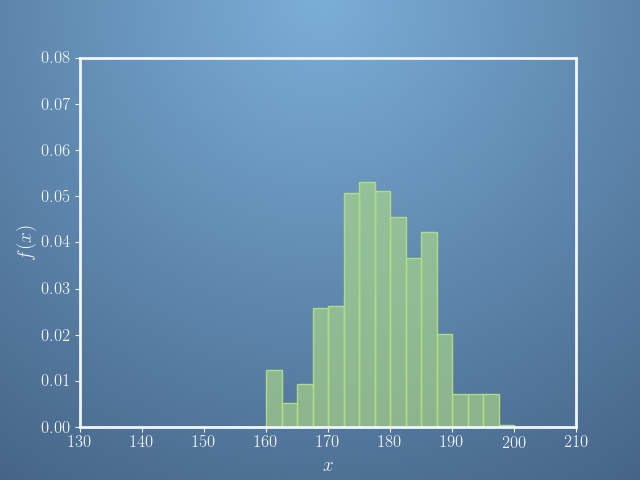
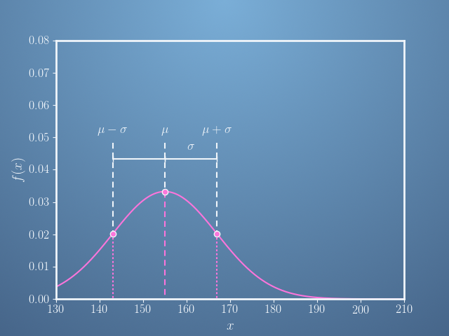

In this quiz, we shall see how quantities in machine learning can be represented as vectors. These could be in the form of data itself, or model parameters, and so on. We will begin to explore why framing our problem in this form might be a useful thing to do.

The problem we shall focus on in this exercise is the distribution of heights in a population.

Since a vector is just a list of numbers, one of the vectors that we can define relates to data that we measure. That is, in this case, we can record the frequency of people with heights between 150cm and 152.5cm, between 152.5cm and 155cm, and so on. We can define this as the vector 
**f** with components,    

  

$$\begin{bmatrix} f_{150.0} - f_{152.5} \cr f_{152.5} - f_{155.0} \cr 
f_{155.0} - f_{157.5} \cr f_{157.5} - f_{160.0} \cr f_{160.0} - f_{162.5} 
\cr . \cr . \cr . \end{bmatrix}$$  

  

This vector can also be represented by the histogram,

  

Of the following statements, select all that are true.

- [ ] None of the other statements
- [ ] The sum of all the frequencies of the bins is one.
- [ ] If another sample was taken under the same conditions, the frequencies would be exactly the same.
- [x] The total area of all the bins sums to one.
- [ ] There are at least 1000 elements in the frequency vector, **f**
- [x] There are at least 15 elements in the frequency vector, **f**.
- [x] If another sample was taken under the same conditions, the frequencies would be broadly similar.  
  
---  
One of the tasks of machine learning is to fit a model to data in order to predict the underlying distribution.

For the heights of a population, a model we may use to predict frequencies is the Normal (or Gaussian) distribution. This is a model for a bell-shaped curve, which looks like this,  
  
  

iQuestion 2
One of the tasks of machine learning is to fit a model to data in order to predict the underlying distribution.

For the heights of a population, a model we may use to predict frequencies is the Normal (or Gaussian) distribution. This is a model for a bell-shaped curve, which looks like this,

It has an equation,  

$$g(x) = \frac{1}{\sigma \sqrt{2\pi }} exp (-\frac{(x-\mu )^{2}}{2\sigma ^{2}})$$  
  
the exact form of which is unimportant, except that it is dependant on two parameters, the mean, 𝜇 where the curve is centred, and the standard deviation, 𝜎,   which is the characteristic width of the bell curve.  

We can put these two parameters in a vector 

$$P = \begin{bmatrix} \mu \cr \sigma \end{bmatrix}$$

Pick the parameter vector  p which best describes the distribution pictured.

- [ ] (a)
      $$P = \begin{bmatrix} 155 \cr 24 \end{bmatrix}$$

